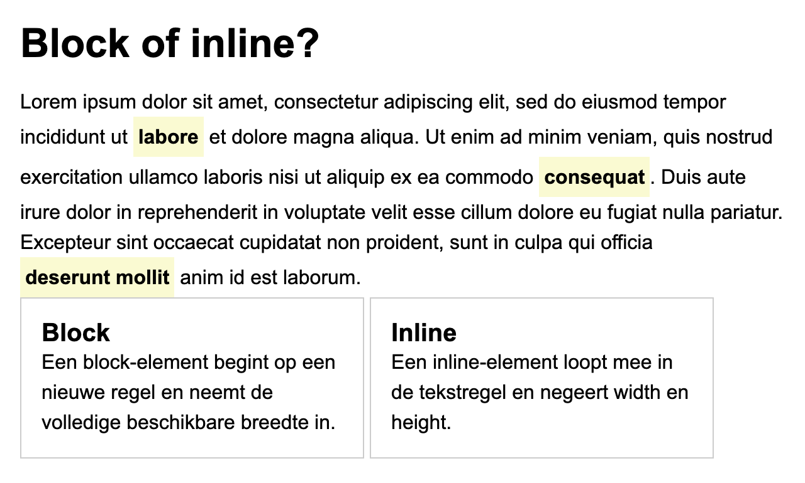

# block-vs-inline

In deze oefening onderzoek je het verschil tussen **block**- en **inline**-elementen, en leer je
wanneer je naar een `div` of een `span` grijpt.

Lees eerst de theorie over [block vs. inline](https://webtechnologie.apload.be/html/block-vs-inline).

Maak zelf `index.html` en `css/style.css` aan en link `normalize.css` en je eigen stylesheet in de `head`.

## Stap 1: inline tekst markeren

* Plaats in een `main` een `h1` met de tekst "Block of inline?" en daaronder een paragraaf van een
  vijftal regels lorem ipsum.
* Zet in die paragraaf drie losse woorden in een `span` met de class `term`.
* Geef `.term` een achtergrondkleur `lightgoldenrodyellow`, 4px padding en `font-weight: bold`.
* Bekijk het resultaat: de tekst blijft gewoon doorlopen, er komt geen regeleinde bij. Maak je
  browservenster smaller tot een gemarkeerd woord over twee regels valt en kijk wat er met de
  achtergrondkleur gebeurt.

## Stap 2: waarom width en height niet werken

* Geef `.term` nu ook `width: 300px` en `height: 100px`.
* Herlaad de pagina. Er verandert niets, want een inline-element negeert `width` en `height`.
* Controleer dat in de DevTools: selecteer het element en kijk in het box model naar de berekende
  breedte.
* Zet daarna `display: inline-block` op `.term`. Nu worden `width` en `height` wél toegepast, en
  tegelijk blijft het woord in de tekstregel staan.
* Haal `width` en `height` daarna weer weg en hou enkel `display: inline-block` over. Zo blijft de
  achtergrondkleur netjes rond het woord staan.

## Stap 3: blokken groeperen met een div

* Plaats onder de paragraaf twee `div`-elementen met de class `kaart`. Elke kaart bevat een `h2` en
  een paragraaf.
* Geef `.kaart` een rand van 1px `solid` in `#cccccc`, 1rem padding en 1rem marge onderaan.
* Bekijk het resultaat: de twee kaarten staan onder elkaar en nemen elk de volledige beschikbare
  breedte in, want een `div` is een block-element.
* Zet nu `display: inline-block` en `width: 45%` op `.kaart`, zodat de twee kaarten naast elkaar
  komen te staan.

## Stap 4: de juiste keuze maken

Zet onderaan je `index.html` in een HTML-commentaar een antwoord op deze twee vragen:

1. Waarom is `` hier de juiste keuze voor de gemarkeerde woorden, en niet `<strong>` of `<em>`?
2. Welk semantisch element zou je gebruiken in plaats van `
` als die kaarten
   elk een afgerond nieuwsbericht zouden bevatten?

> **LET OP**: `div` en `span` zijn je laatste keuze, niet je eerste. Een pagina volstoppen met
> `div`'s noemen we _divitis_. Kijk altijd eerst of er een element bestaat dat de juiste betekenis
> heeft.

## Verwacht eindresultaat

